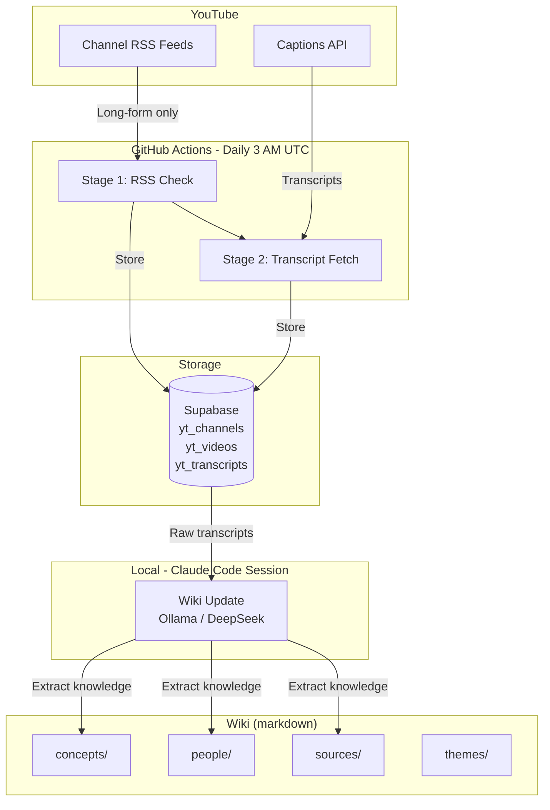
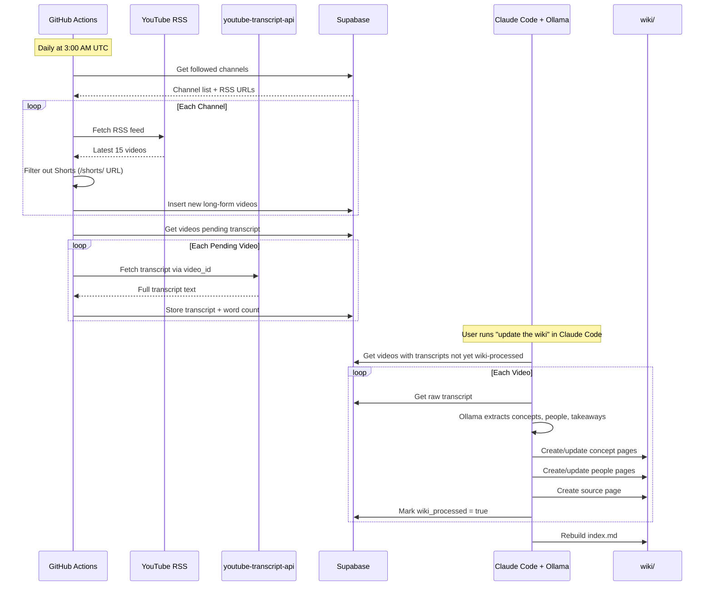
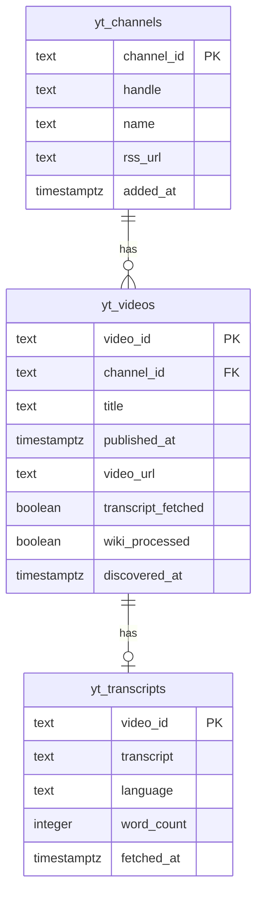

# YouTube Intelligence

An automated pipeline that monitors YouTube channels, fetches transcripts, and builds a compounding LLM wiki for learning — inspired by [Karpathy's LLM Wiki pattern](https://gist.github.com/karpathy/442a6bf555914893e9891c11519de94f). Zero YouTube API keys required.

## Architecture



## Pipeline Flow



## Data Model



## How Each Stage Works

### Stage 1: RSS Check (automated)
- Reads channels from `yt_channels` in Supabase
- Fetches each channel's RSS feed — no API key needed
- **Filters out YouTube Shorts** by checking for `/shorts/` in the RSS link URL
- Inserts only new long-form videos into `yt_videos`

### Stage 2: Transcript Fetch (automated)
- Picks up videos where `transcript_fetched = false`
- Uses `youtube-transcript-api` — no API key needed
- Prefers manual English captions, falls back to auto-generated
- Rate-limited with 2-3 second delays between requests
- Stores full transcript + word count in `yt_transcripts`

### Wiki Update (manual, Claude Code session)
- Reads raw transcripts directly from Supabase
- Uses local Ollama/DeepSeek to extract concepts, people, and takeaways
- Creates/updates interlinked markdown pages in `wiki/`
- Each new video makes the entire wiki richer — concepts get more sources, people get more appearances
- Updates `wiki/index.md` and `wiki/log.md`

## Project Structure

```
youtube_intelligence/
├── .github/workflows/
│   └── daily_pipeline.yml      # GitHub Actions daily at 3 AM UTC
├── pipeline/
│   ├── config.py               # Supabase config + pipeline settings
│   ├── rss_checker.py          # RSS parsing + Shorts filter
│   ├── transcript.py           # Transcript fetching (no API key)
│   ├── storage.py              # Supabase CRUD (singleton client)
│   ├── run.py                  # Orchestrator (2 stages: rss, transcripts)
│   ├── wiki_update.py          # Transcript → wiki knowledge extraction
│   └── requirements.txt        # 3 dependencies
├── wiki/
│   ├── index.md                # Catalog of all wiki pages
│   ├── log.md                  # Chronological ingest log
│   ├── contradictions.md       # Where experts disagree
│   ├── concepts/               # Concept pages (cross-referenced)
│   ├── people/                 # Entity pages for experts/guests
│   ├── sources/                # Per-video knowledge pages
│   └── themes/                 # Cross-cutting synthesis
├── .env.example
├── .gitignore
├── CLAUDE.md
└── README.md
```

## Quick Start

### 1. Install dependencies
```bash
pip install -r pipeline/requirements.txt
```

### 2. Set environment variables
```bash
cp .env.example .env
# Add your SUPABASE_URL and SUPABASE_SERVICE_KEY
```

### 3. Run the pipeline
```bash
python -m pipeline.run                    # both stages
python -m pipeline.run --stage rss        # RSS check only
python -m pipeline.run --stage transcripts # transcripts only
```

### 4. Update the wiki (locally, needs Ollama)
```bash
python -m pipeline.wiki_update
```

## Adding New Channels

```sql
INSERT INTO yt_channels (channel_id, handle, name, rss_url)
VALUES (
    'UC...',
    '@channelhandle',
    'Channel Name',
    'https://www.youtube.com/feeds/videos.xml?channel_id=UC...'
);
```

To find a channel ID from a handle:
```bash
yt-dlp --dump-json --playlist-items 1 --flat-playlist \
    "https://www.youtube.com/@handle/videos" \
    | python -c "import json,sys; d=json.loads(sys.stdin.readline()); print(d['playlist_channel_id'])"
```

## GitHub Actions Setup

Add these secrets to your repo (Settings > Secrets > Actions):

| Secret | Value |
|--------|-------|
| `SUPABASE_URL` | Your Supabase project URL |
| `SUPABASE_SERVICE_KEY` | Your Supabase service role key |

The workflow runs daily at 3:00 AM UTC and can be triggered manually from the Actions tab.

## Configuration

| Variable | Default | Description |
|----------|---------|-------------|
| `SUPABASE_URL` | — | Supabase project URL (required) |
| `SUPABASE_SERVICE_KEY` | — | Supabase service role key (required) |
| `MAX_VIDEOS_PER_RUN` | `20` | Transcript fetch cap per run |
| `TRANSCRIPT_DELAY_SECONDS` | `2.0` | Rate limit between YouTube requests |

## Tech Stack

| Component | Technology | Cost |
|-----------|------------|------|
| Video discovery | YouTube RSS feeds | Free |
| Shorts filtering | RSS link URL pattern | Free |
| Transcripts | `youtube-transcript-api` | Free |
| Database | Supabase (Postgres) | Free tier |
| Knowledge extraction | Ollama + DeepSeek (local) | Free |
| Knowledge base | Markdown wiki (Karpathy pattern) | Free |
| Scheduling | GitHub Actions | Free tier |

**Total cost: $0/month**
